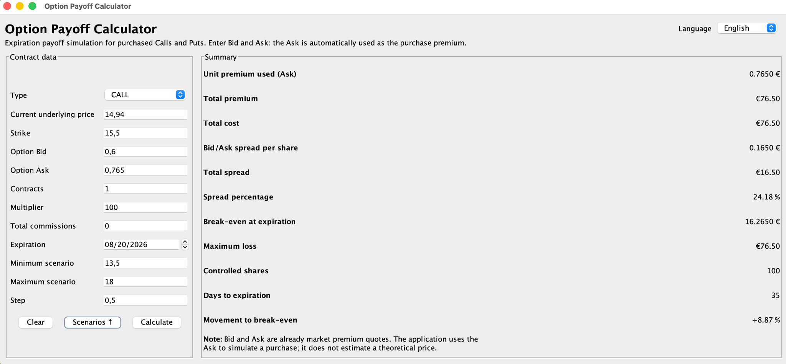
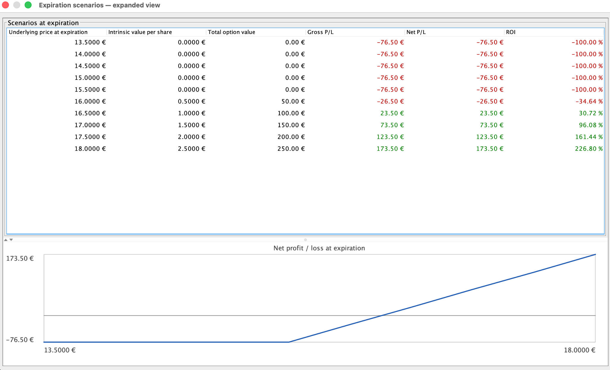

# Option Payoff Calculator

[](https://www.paypal.com/paypalme/lucamezzolla82)

> If you find option-payoff-calculator useful or want to support its development, you can make a small donation through PayPal.  
> Your support helps improve documentation, testing, safety checks, UI polish and controlled production-readiness.

---

## Screenshots

### Main application



### Expiration scenarios



---

A multilingual Java Swing desktop application that simulates the **expiration payoff** of purchased Call and Put options.

The application makes the purchase premium, spread, total cost, break-even point, maximum loss and profit/loss scenarios immediately visible.

## Features

- purchased Call and Put simulations;
- separate **Bid** and **Ask** inputs;
- automatic use of the **Ask** as the purchase premium;
- total premium, total cost and Bid/Ask spread calculations;
- break-even and maximum-loss calculations;
- controlled-share and movement-to-break-even calculations;
- a contextual **Scenarios ↑** button that appears only after a successful calculation;
- scenarios displayed in a separate resizable and maximizable window;
- payoff table and net profit/loss chart;
- runtime interface language switching;
- complete interface translations for:
  - English — default;
  - Italian;
  - Spanish;
  - Portuguese;
  - French;
- localized labels, buttons, validation messages, table headers, chart text and scenario windows;
- support for both comma and dot decimal input;
- commissions included in calculations.

## Technologies

- **Java 21**;
- **Java Swing**;
- Java `ResourceBundle` for internationalization;
- **Maven**;
- **JUnit 5**;
- **BigDecimal** for financial calculations;
- no external UI or chart dependencies.

## Requirements

- JDK 21;
- Maven 3.8 or later.

```bash
java -version
javac -version
mvn -version
```

## Build and run

```bash
mvn clean package
java -jar target/option-payoff-calculator-1.2.0.jar
```

## Tests

```bash
mvn test
```

## Input data

- **Type**: Call or Put.
- **Current underlying price**: current market price of the underlying.
- **Strike**: exercise price.
- **Option Bid**: best current market purchase offer for the option.
- **Option Ask**: best current market sale offer for the option.
- **Contracts**: number of contracts purchased.
- **Multiplier**: units controlled by each contract, commonly 100.
- **Total commissions**: costs included in the simulation.
- **Expiration**: option expiration date.
- **Minimum scenario, maximum scenario and step**: final-price range used to generate scenarios.

For a purchase simulation, the application automatically uses the **Ask** as the unit premium. Bid and Ask are market premium quotes; they do not calculate a theoretical option price.

## Formulas

### Common values

```text
controlled shares = contracts × multiplier
purchase unit premium = Ask
total premium = Ask × controlled shares
unit spread = Ask - Bid
total spread = unit spread × controlled shares
```

### Purchased Call

```text
intrinsic value per share = max(final price - strike, 0)
break-even = strike + Ask + commissions / controlled shares
net profit = total option value - total premium - commissions
```

### Purchased Put

```text
intrinsic value per share = max(strike - final price, 0)
break-even = strike - Ask - commissions / controlled shares
net profit = total option value - total premium - commissions
```

## Scenario window

The main window contains no embedded scenario table or chart. After a successful calculation, **Scenarios ↑** appears next to **Clear**.

The button opens a separate window containing:

- the full payoff table;
- the net profit/loss chart;
- a draggable divider;
- resizing and native maximization support.

Pressing **Clear** removes the current scenarios, hides the button and closes any open scenario windows.

## Internationalization

English is the default interface language. The language selector in the header changes the application immediately without clearing entered values or calculated results.

Translations are stored in:

```text
src/main/resources/i18n/
├── Messages.properties
├── Messages_it.properties
├── Messages_es.properties
├── Messages_pt.properties
└── Messages_fr.properties
```

The language change is also applied to open scenario windows, table headers, chart labels, formatted numbers and validation messages.

## Limitations

The application calculates payoff **at expiration**. It does not estimate the option's theoretical price before expiration.

Before expiration, the option premium also depends on implied volatility, time decay, Delta, Gamma, Vega, rates, dividends and liquidity.

This project is educational and does not constitute financial advice.

## Project structure

```text
src/main/java/it/lucamezzolla/optioncalc
├── OptionCalculatorApp.java
├── i18n
│   ├── AppLanguage.java
│   └── I18n.java
├── model
│   ├── OptionInput.java
│   ├── OptionScenario.java
│   ├── OptionSummary.java
│   └── OptionType.java
├── service
│   └── OptionCalculator.java
├── ui
│   ├── MainFrame.java
│   ├── PayoffChartPanel.java
│   ├── PayoffTableModel.java
│   ├── ProfitLossRenderer.java
│   ├── ScenarioTableSupport.java
│   └── ScenariosDialog.java
└── validation
    └── ValidationException.java
```

## Release and tag `v1.2.0`

```bash
git add .
git commit -m "Add multilingual UI and contextual scenarios window"
git push origin main

git tag -a v1.2.0 -m "Option Payoff Calculator v1.2.0"
git push origin v1.2.0
```

With GitHub CLI:

```bash
mvn clean package
gh release create v1.2.0 \
  target/option-payoff-calculator-1.2.0.jar \
  --title "Option Payoff Calculator v1.2.0" \
  --notes-file RELEASE_NOTES.md
```
